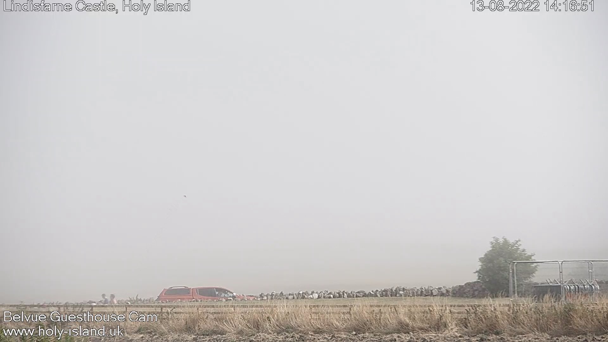

# Livestream Image Recorder

Displays or takes screenshots from an IP webcam or from a livestream URL.

### Installation:

Under Unix run ./install.sh

Under Windows run install.bat

### Example For Displaying the Webcam:

Lindisfarne Castle livestream:
https://www.webcamtaxi.com/en/england/northumberland/holyisland-lindisfarne-castlecam.html

The URL to the same livestream: https://s58.ipcamlive.com/streams/3akqs3fdbty5qmgvu/stream.m3u8

```
python live_stream_handler.py -d -u https://s58.ipcamlive.com/streams/3akqs3fdbty5qmgvu/stream.m3u8
```



### Example For Taking Screenshots

```
python live_stream_handler.py -d -u <url_to_stream> 

```

## For usage use the help option:

```
python live_stream_handler.py [options]
```

```
optional arguments:
  -h, --help            show this help message and exit
  -u URL [URL ...], --url URL [URL ...]
                        Stream URL or IP address. Default: "https://s82.ipcamlive.com/streams/52m18dihyryxpvwv7/stream.m3u8"
  -d, --display_only    Only displays the stream and does not record it.
  -b BUFFER_SIZE, --buffer_size BUFFER_SIZE
                        Size of the buffer to store the number of frames. The bigger this is the smoother stream will be...
  -t [TARGET_FOLDER], --target_folder [TARGET_FOLDER]
                        Only used when saving screenshots. Path to the folder to write. Default will be a date - time named folder
  -q, --quiet           Suppress Output
  -i [SCREENSHOT_INTERVAL_IN_SECONDS], --screenshot_interval_in_seconds [SCREENSHOT_INTERVAL_IN_SECONDS]
                        Waits this many seconds until capturing another screenshot. Default: 60
  -m [MAX_NUM_IMAGES], --max_num_images [MAX_NUM_IMAGES]
                        Stops after capturing this many images. If nothing is passed or -1 is passed, does not stop.

```

Apache License 2.0

